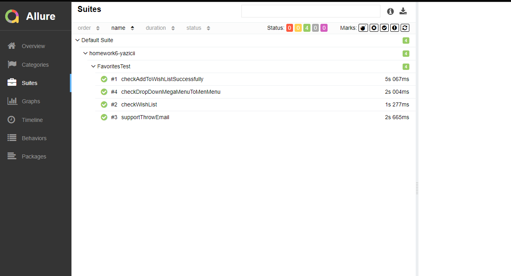

# homework6


# Cumartesi Ödevi
* fromlist stream kullanılmış ve restassured object mapper kullanılarak modele çevirildi.

```
public class FlightTicketRequest {

    Response response;
    public static String flightTicketFromList(String kw) throws UnirestException, IOException {
        HttpResponse<JsonNode> response = Unirest.get("https://www.enuygun.com/ucak-bileti/trip-autocomplete/?term="+kw)
                .header("cookie", "SERVERID-SH=shwww7; SERVERID-SAG=rdwww10")
                .asJson();
        ObjectMapper mapper = new ObjectMapper();
        Root[] flightList = mapper.readValue(response.getBody().toString(), Root[].class);

        return Arrays.stream(flightList).sorted().collect(Collectors.toList()).toString();

    }

    public void flightTiketFromListByRest() throws JsonProcessingException {

        response = given()
                .header("content-type","application/json")
                .when()
                .get("https://www.enuygun.com/ucak-bileti/trip-autocomplete/?term=mer")
                .then()
                .statusCode(200)
                .extract().response();
        response.asString;

    }
}
```


# Pazar Ödevi
* Projeye 2 adet senaryo eklenmiştir.
* FavoritesTest Clasında koşulmuştur.
* Allure kullanırak raporlama yapılmıştır.


